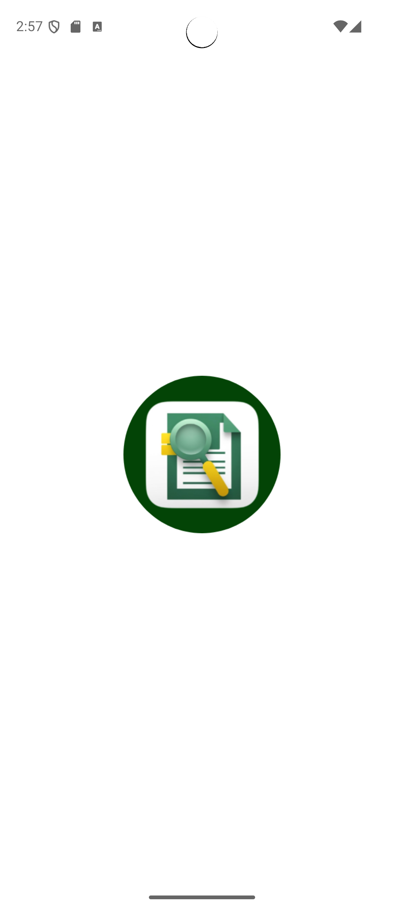
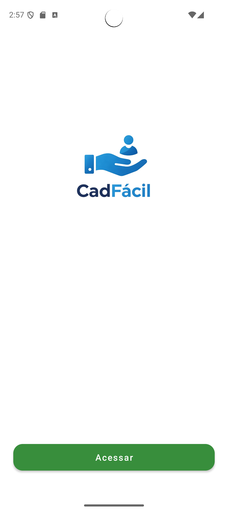
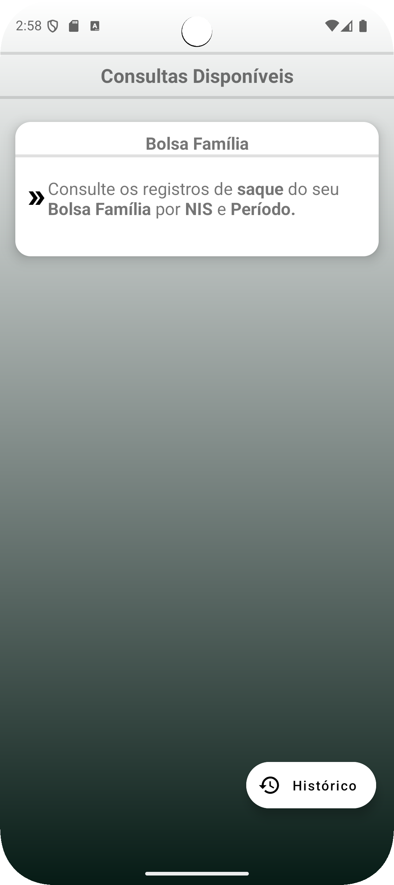
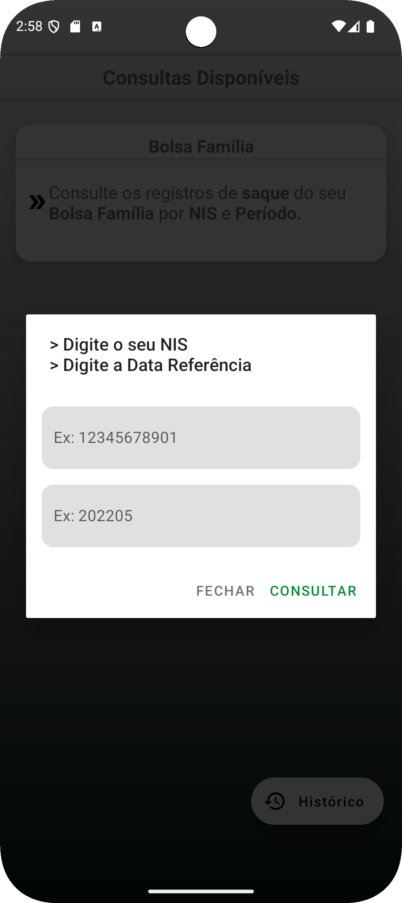

# CadFácil (PT-BR)📱

Este é um aplicativo Android nativo desenvolvido em Kotlin que permite aos usuários consultarem se o benefício do Bolsa Família foi sacado em determinado mês/ano, utilizando o número do NIS como identificador.

A aplicação consome dados da API de Dados Abertos do Governo Federal, retornando informações atualizadas sobre os pagamentos do programa. O usuário pode realizar a busca informando o número do NIS e a data de referência (mês/ano). Se desejar, pode também salvar localmente os resultados da consulta para acessos futuros, mesmo offline.

🛠️ Tecnologias Utilizadas:

 * Kotlin – Desenvolvimento Android nativo,

 * Retrofit – Para chamadas HTTP e integração com a API pública,

 * Room – Armazenamento local opcional dos dados consultados.

##

# CadFácil (EN)📱

This is a native Android application developed in Kotlin that allows users to check whether the Bolsa Família benefit was withdrawn in a specific month/year using the NIS number as an identifier.

The app integrates with the Brazilian Government’s Open Data API to fetch up-to-date information about payments made under the program. Users can input the NIS number and the desired reference date (month/year) to perform the check. Optionally, they can also save the results locally for offline access later.

🛠️ Technologies Used:

* Kotlin – Native Android development

* Retrofit – For HTTP requests and API integration

* Room – Optional local data storage

  
  
  
  

